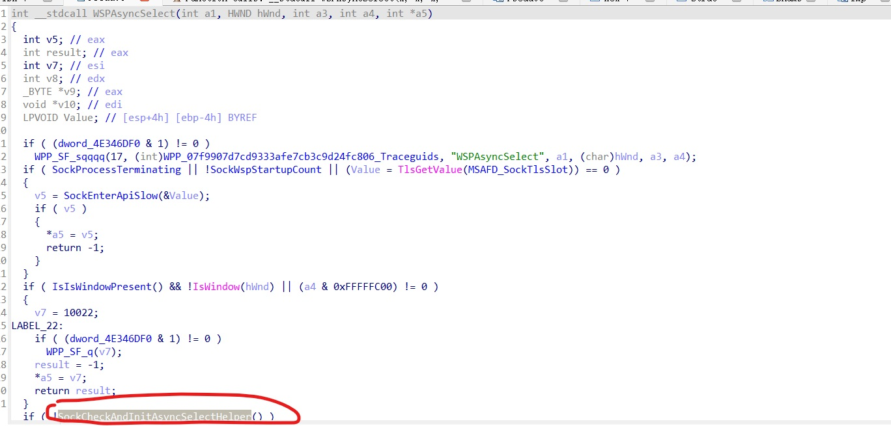
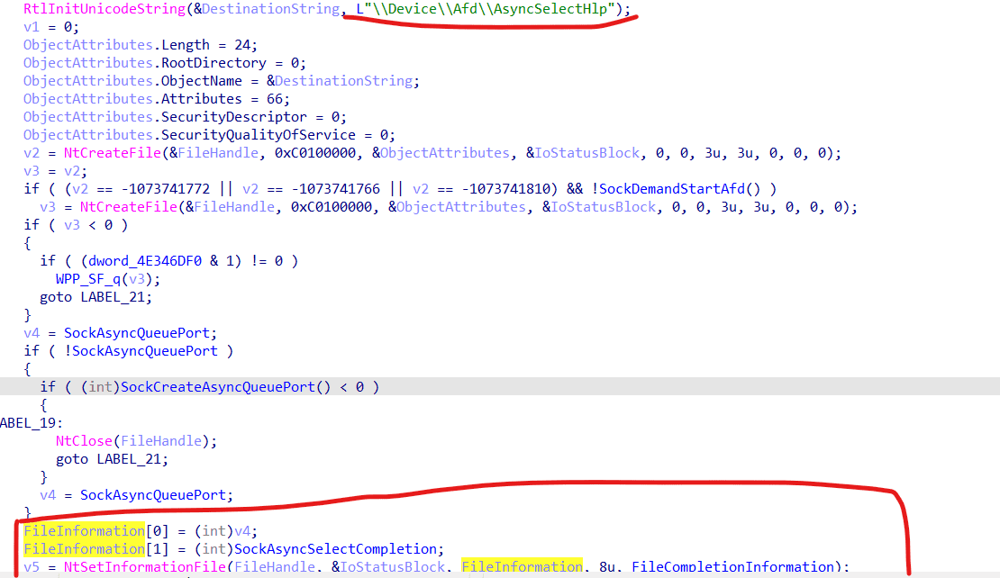
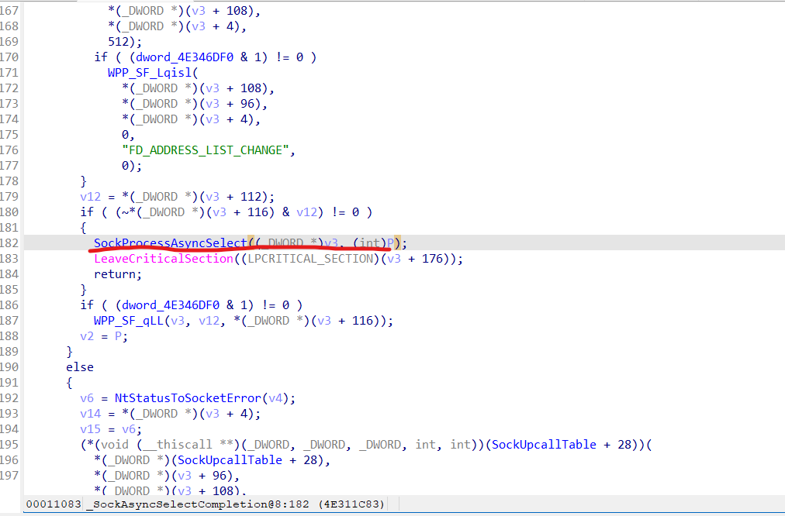
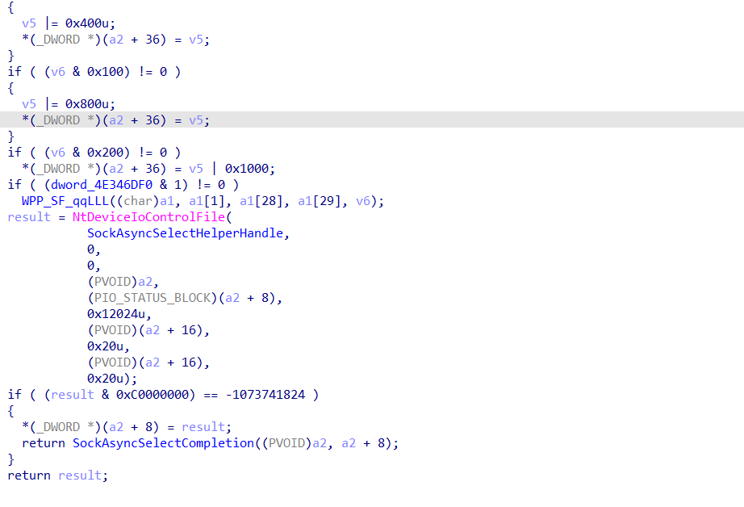
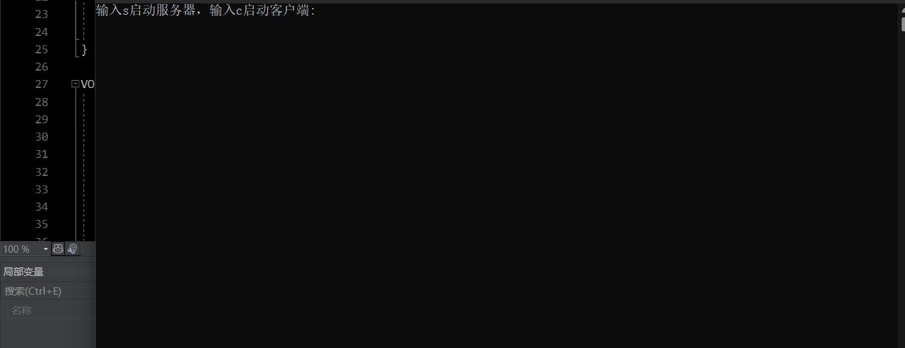
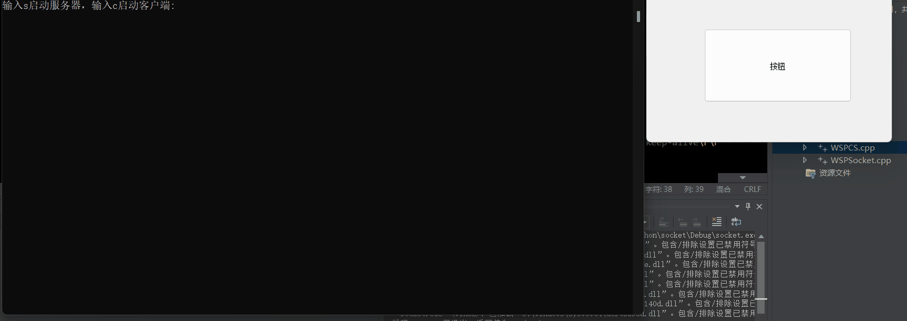

# NtSocket_NtClient_NtServer：
   - Using NtCreateFile and NtDeviceIoControlFile to realize the function of winsock
   - 利用NtCreateFile和NtDeviceIoControlFile实现winsock的功能。
   - 部分功能参考ReactOS源码实现。
   - 现在已经成功封装出了一个NtClient和一个NtServer。
   - 源码主体实现了以下函数：
      - WSPSocket（创建socket句柄）
      - WSPCloseSocket（关闭socket）
      - WSPBind（Bind一个地址，支持IPv6）
      - WSPConnect（连接一个地址，大致用法同Connect函数，支持IPv6）
      - WSPShutdown（Shutdown指定操作，可以同WSAShutdown使用）
      - WSPListen（基本同Listen函数）
      - WSPRecv（接收数据，基本同Recv）
      - WSPSend（发送数据，基本同send）
      - WSPGetPeerName（基本同GetPeerName，支持IPv6）
      - WSPGetSockName（基本同GetSockName，支持IPv6）
      - WSPEventSelect（事件选择模型，基本同WSAEventSelect）
      - WSPEnumNetworkEvents（事件选择模型，基本同WSAEnumNetworkEvents）
      - WSPAccept（基本完整实现accept功能）
      - WSPProcessAsyncSelect（本源码最大的亮点，APC异步Select模型，这是winsock没有开放的模型，IOCP模型本质上也依赖这个完成）

# 前言：
   - 本程序只能使用于Windows。
   - 本程序开发环境：Win11 x64.
   - 本程序理论上兼容x64和x86环境，不过具体出现问题还得具体分析。

# 为什么写它？
   - 之前看了一篇文章：[NTSockets - Downloading a file via HTTP using the NtCreateFile and NtDeviceIoControlFile syscalls](https://www.x86matthew.com/view_post?id=ntsockets "NTSockets - Downloading a file via HTTP using the NtCreateFile and NtDeviceIoControlFile syscalls")
   - 我觉得这篇文章非常有意思，**直接利用NtCreateFile和Afd驱动建立通信，然后利用NtDeviceIoControlFile实现向afd发送socket控制的信息**。
   - 不过美中不足的是这个程序支持x86（原因是结构体定义的问题），同时也仅实现了Client，其他部分还没有完善。
   - 于是便有了这个程序。

# 正文：
   - 最基础的内容，利用NtCreateFile创建socket句柄：
```cpp
SOCKET WSPSocket(
	int AddressFamily,
	int SocketType,
	int Protocol) {
	/// <summary>
	/// 类似于Socket函数，可以创建一个Socket文件句柄
	/// </summary>
	/// <param name="AddressFamily">Address family(Support IPv6)</param>
	/// <param name="SocketType">Socket Type</param>
	/// <param name="Protocol">Protocol type</param>
	/// <returns>如果失败返回INVALID_SOCKET，成功返回Socket文件句柄</returns>
	if (AddressFamily == AF_UNSPEC && SocketType == 0 && Protocol == 0) {
		return INVALID_SOCKET;
	}
	//进行基础数据设置
	if (AddressFamily == AF_UNSPEC) {
		AddressFamily = AF_INET;
	}
	if (SocketType == 0)
	{
		switch (Protocol)
		{
		case IPPROTO_TCP:
			SocketType = SOCK_STREAM;
			break;
		case IPPROTO_UDP:
			SocketType = SOCK_DGRAM;
			break;
		case IPPROTO_RAW:
			SocketType = SOCK_RAW;
			break;
		default:
			SocketType = SOCK_STREAM;
			break;
		}
	}
	if (Protocol == 0)
	{
		switch (SocketType)
		{
		case SOCK_STREAM:
			Protocol = IPPROTO_TCP;
			break;
		case SOCK_DGRAM:
			Protocol = IPPROTO_UDP;
			break;
		case SOCK_RAW:
			Protocol = IPPROTO_RAW;
			break;
		default:
			Protocol = IPPROTO_TCP;
			break;
		}
	}
	byte EaBuffer[] = {0x00, 0x00, 0x00, 0x00, 0x00, 0x0F, 0x1E, 0x00, 
		0x41, 0x66, 0x64, 0x4F, 0x70, 0x65, 0x6E, 0x50, 
		0x61, 0x63, 0x6B, 0x65, 0x74, 0x58, 0x58, 0x00, 
		0x00, 0x00, 0x00, 0x00, 0x00, 0x00, 0x00, 0x00, 
		0x02, 0x00, 0x00, 0x00, 0x01, 0x00, 0x00, 0x00, 
		0x06, 0x00, 0x00, 0x00, 0x00, 0x00, 0x00, 0x00, 
		0x08, 0x01, 0x00, 0x00, 0x00, 0x00, 0x00, 0x00,
		0x00, 0x00, 0x00, 0x00, 0x00, 0x00, 0x00, 0x00};
	memmove((PVOID)((__int64)EaBuffer + 32), &AddressFamily, 0x4);
	memmove((PVOID)((__int64)EaBuffer + 36), &SocketType, 0x4);
	memmove((PVOID)((__int64)EaBuffer + 40), &Protocol, 0x4);
	if (Protocol == IPPROTO_UDP)
	{
		memmove((PVOID)((__int64)EaBuffer + 24), &Protocol, 0x4);
	}
	//初始化UNICODE_STRING：
	UNICODE_STRING AfdName;
	AfdName.Buffer = L"\\Device\\Afd\\Endpoint";
	AfdName.Length = 2 * wcslen(AfdName.Buffer);
	AfdName.MaximumLength = AfdName.Length + 2;
	OBJECT_ATTRIBUTES  Object;
	IO_STATUS_BLOCK IOSB;
	//初始化OBJECT_ATTRIBUTES
	InitializeObjectAttributes(&Object,
		&AfdName,
		OBJ_CASE_INSENSITIVE | OBJ_INHERIT,
		0,
		0);
	HANDLE MySock;
	NTSTATUS Status;
	//创建AfdSocket：
	Status = ((NtCreateFile)MyNtCreateFile)(&MySock,
		GENERIC_READ | GENERIC_WRITE | SYNCHRONIZE,
		&Object,
		&IOSB,
		NULL,
		0,
		FILE_SHARE_READ | FILE_SHARE_WRITE,
		FILE_OPEN_IF,
		0,
		EaBuffer,
		sizeof(EaBuffer));
	if (Status != STATUS_SUCCESS) {
		return INVALID_SOCKET;
	}
	else {
		return (SOCKET)MySock;
	}
}
```
   - 从总体上看来，这部分代码是最简单的，用NtCreateFile创建\\Device\\Afd\\Endpoint的连接，麻烦一点的可能是传递的EaBuffer，不过这部分可以直接通过CE拦截的方式获取数据，也可以参考ReactOS的结构体，我选择了一种介于两者之间的方法实现。
   - 这部分的兼容性也是最难实现的，因为不知道不同的系统的结构体会不会有差异，不过我测试基本是没有问题的。
   - 创建出socket句柄后，剩下的事情就非常简单了，只需要根据不同的“IOCTL_AFD_”写出各个函数即可。
   - 最难的部分其实是WSPProcessAsyncSelect函数。
   - 这个需要从WSPAsyncSelect函数说起
   - 使用IDA看一下mswsock.WSPAsyncSelect函数，大概长这个样子：
   - 其中最重要的函数是SockCheckAndInitAsyncSelectHelper：
   - SockCheckAndInitAsyncSelectHelper函数先创建了一个\\Device\\Afd\\AsyncSelectHlp的IO（功能未知），**然后用SockCreateAsyncQueuePort函数创建了一个完成端口**
   - 接着用NtSetInformationFile函数将完成端口和\\Device\\Afd\\AsyncSelectHlp绑定。
   - 在SockAsyncSelectCompletion函数中找到SockProcessAsyncSelect：
   - 在SockProcessAsyncSelect中找到AsyncSelect真正实现原理：
   - （别问我怎么找的，参看ReactOS源码就会很清晰）
   - 图中的操作应该是轮询实现的，效率比较低。
   - 不过别忘了，NtDeviceIoControlFile是提供了APCRoutine的接口的。
   - **实际上只需要给NtDeviceIoControlFile以APCRoutine接口，就可以实现无需轮询的AsyncSelect**。
   - 大致实现：
```cpp
NTSTATUS WSPProcessAsyncSelect(
	SOCKET Handle,
	PVOID ApcRoutine,
	ULONG lNetworkEvents,
	PVOID UserContext
) {
	/// <summary>
	/// WSPProcessAsyncSelect是本程序最大的亮点，利用异步化的IOCTL_AFD_SELECT
	/// </summary>
	/// <param name="Handle"></param>
	/// <param name="ApcRoutine"></param>
	/// <param name="lNetworkEvents"></param>
	/// <returns></returns>
	AFD_AsyncData* AsyncData = (AFD_AsyncData*)malloc(sizeof(AFD_AsyncData));
	if (AsyncData == NULL)
	{
		return -1;
	}
	memset(AsyncData, 0, sizeof(AFD_AsyncData));
	AsyncData->NowSocket = Handle;
	AsyncData->PollInfo.Timeout.HighPart = 0x7FFFFFFF;
	AsyncData->PollInfo.Timeout.LowPart = 0xFFFFFFFF;
	AsyncData->PollInfo.HandleCount = 1;
	AsyncData->PollInfo.Handle = Handle;
	AsyncData->PollInfo.Events = lNetworkEvents;
	AsyncData->UserContext = UserContext;
	NTSTATUS Status;
	Status = ((NtDeviceIoControlFile)(MyNtDeviceIoControlFile))((HANDLE)Handle,
		NULL,
		ApcRoutine,
		AsyncData,
		&AsyncData->IOSB,
		IOCTL_AFD_SELECT,
		&AsyncData->PollInfo,
		sizeof(AFD_PollInfo),
		&AsyncData->PollInfo,
		sizeof(AFD_PollInfo));
	return Status;
}
```
   - 既然已经做出了肌醇函数，剩下的就是封装了。
   - 我封装了“WSPClient”和“WSPServer”两个类（一个客户端，一个服务端）
   - 虽然功能不是很齐全，但是至少是能用的。
   - 主体说一下WSPServer的AsyncSelect：
   - 核心源码：
```cpp
VOID __stdcall internal_APCRoutine(
	PVOID ApcContext,
	PIO_STATUS_BLOCK IoStatusBlock,
	PVOID Reserved)
{
	/// <summary>
	/// 这是一个内部函数，也是本程序最大的亮点：APC异步select
	/// Client和服务器socket的select情况会全部调用这个函数，本函数用于分发回调事件。
	/// </summary>
	/// <param name="ApcContext"></param>
	/// <param name="IoStatusBlock"></param>
	/// <param name="Reserved"></param>
	/// <returns></returns>
	AFD_AsyncData* AsyncData = (AFD_AsyncData*)ApcContext;
	//读取出ApcContext，保存的是AsyncData，AsyncData的详细使用情况请看WSPProcessAsyncSelect函数的实现。
	WSPServer* self = (WSPServer*)AsyncData->UserContext;
	//读取出WSPServer对象，这个主要是读取出回调函数地址。
	//然后调用回调函数，参数是socket句柄和事件信息
	((WSPServerCallBack)self->m_CallBack)(AsyncData->NowSocket, AsyncData->PollInfo.Events);
	//开启下一次APC异步select
	WSPProcessAsyncSelect(AsyncData->NowSocket, internal_APCRoutine, self->m_EnableEvent, (PVOID)self);
	//释放掉原来的AsyncData
	free(AsyncData);
}


VOID WSPServer::internal_APCThread(WSPServer* Server) {
	/// <summary>
	/// 本函数是APC异步select的线程函数，用于开启每个socket的APC异步select
	/// </summary>
	/// <param name="Server">WSPServer对象</param>
	int i = 0;
	while (1) {
		EnterCriticalSection(&Server->m_CriticalSection);
		if (!Server->IsRun) {
			//已经通知本线程退出
			LeaveCriticalSection(&Server->m_CriticalSection);
			break;
		}
		i = Server->m_NeedAPCSocket.size();
		i--;
		for (i; i >= 0; i--) {
			//将m_NeedAPCSocket每一socket读取出来，开启APC异步select
			WSPProcessAsyncSelect(
				Server->m_NeedAPCSocket[i],
				internal_APCRoutine,
				Server->m_EnableEvent, 
				(PVOID)Server
			);
			//后面的APC异步select过程将由函数internal_APCRoutine完成
			Server->m_NeedAPCSocket.pop_back();
			//删除m_NeedAPCSocket对应的socket
		}
		LeaveCriticalSection(&Server->m_CriticalSection);
		SleepEx(1, true);
	}
}

HANDLE WSPServer::APCAsyncSelect(
	WSPServerCallBack*	ApcCallBack,
	int lNetworkEvents
) {
	/// <summary>
	/// 开启服务器的APC异步select模式，只能初始化一次
	/// </summary>
	/// <param name="ApcCallBack">回调函数</param>
	/// <param name="lNetworkEvents">需要异步处理的事件</param>
	/// <returns>返回异步处理线程的句柄</returns>
	if (this->m_CallBack != NULL) {
		return INVALID_HANDLE_VALUE;
	}
	EnterCriticalSection(&this->m_CriticalSection);
	this->m_EnableEvent = lNetworkEvents;
	this->m_CallBack = ApcCallBack;
	//下面将把m_AllClientSocket已有的句柄拷贝到m_NeedAPCSocket
	std::copy(m_AllClientSocket.begin(), m_AllClientSocket.end(), m_NeedAPCSocket.begin());
	//将服务器socket加入m_NeedAPCSocket
	m_NeedAPCSocket.push_back(this->m_socket);
	//启动线程
	m_ThreadHandle = CreateThread(NULL, 0, (PTHREAD_START_ROUTINE)internal_APCThread, this, 0, NULL);
	LeaveCriticalSection(&this->m_CriticalSection);
	return m_ThreadHandle;
}
```
   - 就是利用WSPProcessAsyncSelect函数实现APC异步选择
   - 当select状态改变时，程序会通知internal_APCRoutine，internal_APCRoutine再进行回调函数的分发和下一次AsyncSelect的调用。
   - 写得不是很精简，勉强能用吧。
   - 这种APC方法省去了IOCP模型中很多复杂的步骤，可以说是一个最精简的异步模型了。

# 测试：
   - Client端请求`http://www.baidu.com/index.html`测试：
   - Server端1000连接测试：
   - 测试Server端上万连接，APC效率基本无损失。
